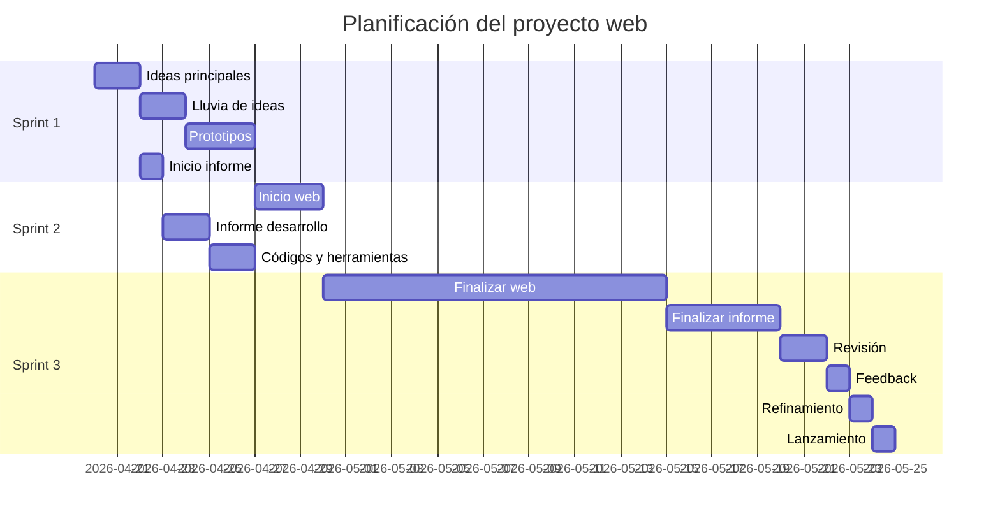

# 📊 Planificación del Proyecto Web

Este proyecto ha sido organizado en tres sprints, teniendo en cuenta que soy el único integrante del equipo. La planificación refleja una progresión lógica donde el desarrollo depende del diseño previo y el informe del avance general.

---

## 🗓️ Diagrama de Gantt

---

# CitaFácil

## 1. Título
CitaFácil

## 2. Integrantes del proyecto
- Jiachen

## 3. Objetivos
El objetivo es crear una página web para una empresa centrada en la gestión de citas administrativas, donde se centralicen los servicios ofrecidos. La web debe ser clara, accesible y adaptada a usuarios con poca experiencia digital, incluyendo múltiples subpáginas y funcionalidades alineadas con las necesidades detectadas previamente.

## 4. Explicación del proyecto
El proyecto consiste en el desarrollo de una plataforma web para ayudar a personas con dificultades digitales a gestionar citas administrativas.

Está dirigida especialmente a:
- Personas mayores  
- Usuarios con baja competencia digital  
- Nuevos residentes  

La web ofrecerá:
- Guías claras  
- Asistencia personalizada  
- Acompañamiento durante el proceso  

Se prioriza una interfaz simple, intuitiva y accesible, evitando la sobrecarga de información.

## 5. Material del proyecto

### Hardware
- Ordenador  

### Software
- Visual Studio Code  
- HTML  
- CSS  
- Java  
- Tailwind (en pruebas)  

### Herramientas de diseño
- Canva  
- Paint  
- Pixlr  
- Background Remover  
- Picsart  
- Adobe  

### Otros recursos
- ChatGPT  
- Proyectos anteriores  
- Formularios A/B  
- MVPs  
- Páginas de inspiración (Doctoralia, Puma, RACC)

## 6. Desarrollo y despliegue
El desarrollo se ha basado en un proceso estructurado:

1. Creación de prototipos (a mano e IA)  
2. Diseño visual de la web  
3. Implementación en HTML y CSS  
4. Aplicación de diseño responsive  
5. Creación de iconos propios  
6. Pruebas y revisiones  

Se ha utilizado Visual Studio Code como entorno de desarrollo y se han aplicado mejoras basadas en proyectos anteriores.

## 7. Planificación

### Sprint 1 (20/4 - 28/4)
- Definir ideas principales  
- Identificar objetivo y público  
- Definir funcionalidades  
- Lluvia de ideas  
- Crear prototipos  
- Inicio del informe  

### Sprint 2 (28/4 - 5/5)
- Desarrollo inicial web  
- HTML y CSS  
- Componentes principales  
- Continuación del informe  
- Documentación técnica  

### Sprint 3 (5/5 - 29/5)
- Finalización web  
- Corrección de errores  
- Optimización  
- Finalización informe  
- Pruebas  
- Feedback  
- Mejoras  
- Entrega final  

### Problemas detectados
- Dependencia de prototipos para empezar  
- El informe depende del progreso del proyecto  

## 8. Webgrafía
- https://eu.puma.com/es/es/help/contact-us?srsltid=AfmBOoqUPo26kPCMh1fNhYsJJ2r-e5A_IDaLNgtelP3CP8lNQLrl5Vl0
- https://www.doctoralia.es/
- https://joseasd213.github.io/si/

## 9. Anexos
- Imágenes del proceso  
- Prototipos  
- Ilustraciones a mano  
- Ilustraciones con IA  
- Iconos  
- Referencias visuales  
