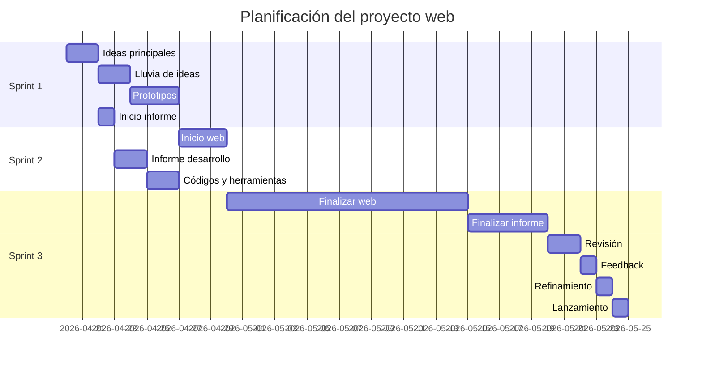

# 📊 Planificación del Proyecto Web

Este proyecto ha sido organizado en tres sprints, teniendo en cuenta que soy el único integrante del equipo. La planificación refleja una progresión lógica donde el desarrollo depende del diseño previo y el informe del avance general.

---

## 🗓️ Diagrama de Gantt

---

## ⚙️ Organización del trabajo

El proyecto se ha dividido en tres fases principales (sprints):

### Sprint 1

En esta fase inicial se definen las bases del proyecto:

* Ideas principales
* Objetivos
* Público objetivo
* Primeros diseños y prototipos

También se inicia el informe para documentar el planteamiento del proyecto.

### Sprint 2

Se comienza el desarrollo de la página web:

* Estructura HTML
* Estilos CSS
* Componentes principales

Paralelamente, se continúa el informe explicando el proceso y las herramientas utilizadas.

### Sprint 3

Fase final del proyecto:

* Finalización y optimización de la web
* Redacción final del informe
* Revisión y pruebas
* Recogida de feedback
* Mejoras finales
* Entrega del proyecto

---

## ⚠️ Dependencias del proyecto

* La creación de la página web depende de:

  * La lluvia de ideas
  * Los prototipos iniciales

* El informe depende del progreso general del proyecto, ya que documenta todo el proceso.

---

## Integrante

-Jiachen

---
